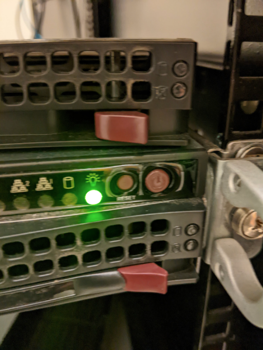

The physical server for `simmons.mit.edu` lives in the Simmons basement in the RoR (room of requirements). If you don't have access, then ask the current house manager to help.

The buttons you need to press should be facing you when you enter the room with the server. **Press the power button, not the reset button** to restart the server. (The reset button causes bad stuff to happen). This is what the buttons look like:

