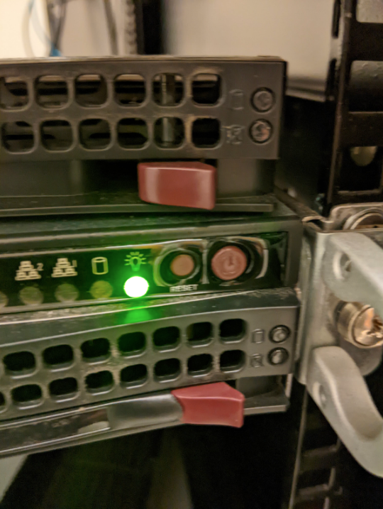

import { LinkCard, CardGrid } from "@astrojs/starlight/components";

:::caution
This is a copy of the transition doc, with formatting and link changes. Most of the information here can be found in other pages in a more consise, easy to read manner. Most things in here are **severely** out of date, don't exist anymore, or have other problems.
:::

- Get root kerb from IS&T (optional, good practice in case kerb password is stolen)
- Add to mailing lists (`simmons-tech`)
- Make moderator on mailing lists
- Share transition docs / passwords
- Share links
- Give superuser / staff access on rooming admin site
- Add kerb to elections:
  - `/mit/simmons-hall/Scripts/django/SimmonsElections-repo/SimmonsElections/polls/views.py` admin kerbs
- Get RoR access (since the server lives there)

## General Tips

- Skim this entire document when you run into issues
- Super useful to memorize the mailing list default pw (can be found in the spreadsheet)
- If you can't figure something out and no one knows the answer, talk to Quentin Smith

## Notes on Server

- Located in the RoR
- **PLEASE DO NOT TAMPER WITH THE PHYSICAL SERVER. THE SERVER EXISTS ON A VIRTUAL IMAGE AND THE IMAGE MAY NOT BE ABLE TO START IF YOU RESTART THE SERVER. CAN CONFIRM BASED ON PERSONAL EXPERIENCE.**
- 3 hard drives
  - The 80 GB one runs the old version simmons.mit.edu
    - OS: Scientific Linux 5.1
  - The other 2 run metal-gear
    - OS: Debian 7
    - Metal-gear is the actual server, the simmons server is actually a vm on metal-gear
  - Simmons.mit.edu is potentially on old-simmons
    - old-simmons5 contains root filesystem, old-simmons6 contains /var/

## Virtual Machines

- `ssh root@metal-gear.mit.edu` (password in spreadsheet)
- `cd /etc/xen && ls -al` to list all possible vms
- `xl create <server name>` to spin one up
- `xl console <server name>` to attach to a console (kinda flakey? )

### How to make new VM

- Request new hostname: https://ist.mit.edu/network/ip-student
  - Hardware addresses follow the pattern `00:16:3e:ff:ff:xx` (change last bit)
- `root@metal-gear:/etc/xen# lvcreate -L 50G -n <hostname>-root metal-gear`
- Do the same step as above except for swap instead of root (and use 8G)
- `root@metal-gear:/etc/xen# cat /etc/xen/<hostname>`

```sh title="cat /etc/xen/<hostname>"
vcpus = 2
memory = 4096
maxmem = 16384
name = '<hostname>'
#bootloader = 'pygrub'
disk = ['phy:/dev/metal-gear/<hostname>-root,xvda,w', 'phy:/dev/metal-gear/<hostname>-swap,xvde,w']
vif = ['bridge=xenbr0, mac=00:16:3e:ff:ff:10']
```

## Simmons DB

### Admin/Permissions

- DB Control Panel: https://simmons.mit.edu/sds/administrators/
  - Can add users to different access groups
  - Don't forget to refresh group cache!
- To access Simmons website and DB backend code, first
  - `$ ssh <username>@athena.dialup.mit.edu`
  - Log in with kerb pw
- Then `$ ssh root@simmons.mit.edu`

### People Locked Out

- Impersonate them (Be Another User under admin header) on db
- Set login password

### Editing the DB

- Can make changes to existing users directly on the DB site (kerb will stay the same)
- Ssh into `root@simmons.mit.edu`
- Get credentials from `/var/www/sds/sdb-passwd-apache`
- Log in with command
  - `$psql sdb sds`
  - `$\dt` to list all tables
- **DB scripts in `/var/www/html/sds`**
- Changing people in the DB:
  - Edit directory and sds_users_all tables
  - `/var/www/html/sds/sds/header.php` contains nav bar links

<CardGrid>
  <LinkCard
    title="SQL Commands"
    href="https://www.w3schools.com/sql/default.asp"
  />
  <LinkCard
    title="PSQL commands"
    href="http://www.postgresqltutorial.com/postgresql-cheat-sheet/"
  />
</CardGrid>

### Editing the website (`simmons.mit.edu`)

- Files in `/var/www/`

## Scripts

- On athena dialup machine
- `cd /mit/simmons-hall` (hidden but there)
- Read scripts.mit.edu site
- Rooming and elections are here
- `cd /mit/simmons-hall/Scripts/django` for repos
- Slowly migrate dashboard and 7k to here
- These are github repos
- Add people to the git org

## Adding login to simmons server

- Ssh into `root@simmons.mit.edu`
- Add kerb to `/root/.k5login`

## Mailman bug

- View log at `/var/mail/root`
- Silent fail- no mailing list updates
- Remove the rule
- Potentially do DB mailing list for all non-mit emails

### Fix Officers Mailing list

- Broken SSL
- `simmons.mit.edu/mailman/admindb/LIST_NAME`
- Click admin interface link on any mailing list
- Click Membership management / mass subscription to add all new frosh

## Dashboard

- `ssh root@simmons-dev.mit.edu`
  - Pw in spreadsheet
- `/home/dashboard/simmons-dashboard/dashboard` to edit things
- View online at http://simmons-dev.mit.edu/dashboard/lightweight
- Specifics like weather at http://simmons-dev.mit.edu/dashboard/weather/
- Used to be run by a pi at desk
- Outside dining for dashboard is Mac mini
- When making django changes, run `apachectl -k restart` to restart to see changes

## 7k Add Access

- https://simmons-dev.mit.edu/admin7k/profile
- Add pub chairs as staff and superuser
- https://simmons-dev.mit.edu/admin7k/admin
- Add them as a user give blank or tmp pw (doesn't matter)
- Add staff and super user
- On simmons dev server - go to `/var/www/7k` for code

## Mailing Lists

- Rules for lists
- Diff for mod vs unmod
- Need to refresh group cache and mailing lists after modifying/creating a list!

## Replacing Reimbursement PDF

- View PDF [here](http://simmons.mit.edu/SimmonsReimbursement.pdf)
- ssh into `simmons.mit.edu`
- Scp the PDF into `/var/www/html/SimmonsReimbursement.pdf`

## Short links (`simmons.mit.edu/<x>`)

- ssh into `simmons.mit.edu`
- Edit apache config (at `/etc/httpd/conf/httpd.conf` (I think?)) Just copy an existing rule (search for reimbursement, for example)

## Elections

- https://sql.scripts.mit.edu/phpMyAdmin/ (password is in passwords spreadsheet)
- Table: elections
  - Update polls_poll with open elections (positions)
    - Role: pull from [simmons.mit.edu/officers](https://simmons.mit.edu/officers) (just first sentence)
    - Order: Roughly as listed by the officers page (or by constitution), with uncontested elections last
  - Update `auth_user` with resident list
    - Ask rooming, or pull from the DB (Desk -> Full Directory Listing (you might need to give yourself desk privileges))
    - Save as CSV
    - Easiest way: Import tab on phpMyAdmin (you usually need to use the column names field)
  - Update polls_resident with resident kerbs
  - Update polls_choice with candidates
    - Poll_id -> polls_poll id for race
    - Choice: name(s)
    - Bio: whatever they submit (use `<br>` for line breaks!)
    - Profile: name of photo from from `/mit/simmons-hall/web_scripts/elections/static/polls/pics`
      - Should be square (crop for them)
      - If no submission, use `empty-photo.jpg`
- Site: https://simmons-hall.scripts.mit.edu:444/elections/index (or [simmons.mit.edu/vote](https://simmons.mit.edu/vote))
  - Elections should show up there after those two steps
- On athena go to
  - `/mit/simmons-hall/Scripts/django/SimmonsElections-repo/SimmonsElections/polls/views.py`
  - Set status to `polls_open`
  - Close it there in a week
- Put photos in `/mit/simmons-hall/web_scripts/elections/static/polls/pics` on athena
  - Put the `name.jpg` in the entry in polls_choice
- Edit `/mit/simmons-hall/Scripts/django/SimmonsElections-repo/SimmonsElections/polls/templates/polls` (various html files)
  - Put the date that voting ends
  - Update 20xx-20xy to the current year
- Results:
  - On Athena, ssh to scripts: `ssh -K`
  - Broken????

### Jordan's Notes

- Will upload files somewhere later (on server)
  1. 100% the script works on 2 candidate elections/clear majorities
  2. 90% sure it works on the rank choice but has only ever been needed/tested on 3 candidates
  3. I lied, Script is [in drive](https://drive.google.com/file/d/1apjo9FhQtRR3wVpr0z1HAMrG2KZwKHOS/view?usp=share_link) cuz that was easier
- Once elections are over
  1. Go to MyPHP thingy and export the following tables to CSVs (do them separately so they're not all one CSV):
     - Polls_answerset
     - Polls_choice
     - Polls_poll
  2. Upload them to the same folder that my script is in/rename files to their table names
  3. Run script and pray

@ `/mit/simmons-hall/` on athena
`Web_scripts` is static resources
Django code is in Scripts

## Updating officers on the website

- To update https://simmons.mit.edu/officers/, ssh to `simmons.mit.edu` server
- It's at `/var/www/officers` on simmons.mit.edu.
- Edit `js/incumbents.js` to put in which officers go where.
- Edit `js/people.js` to add in any new officers.
- For any new officers (+ joint tickets), you'll need to add photos to `img/photos`. You should be able to scp over anything you need from `/mit/edwardf/elections_2017` `/mit/simmons-hall/web_scripts/elections/static/polls/pics` on Athena.
- Check that the page looks right!
- Photos `/var/www/officers/img/photos`

## Rooming

## Getting ready for lottery

- On athena, `/mit/simmons-hall/Scripts/django/simrooming/rooming-randomization/rooming-randomization.py` has the lottery script - instructions are in the file
  - `in.csv` provided by rooming chair

### Rooming Picks

- Empty out `simmonshall-rooming1` `rooming_resident` (clears the map) on https://sql.scripts.mit.edu/phpMyAdmin/
- On athena, `cd /mit/simmons-hall/Scripts/django/simrooming/rooming`
- Edit `views.py` and flip flag to enable or disable access
- On athena, update `/mit/simmons-hall/Scripts/django/simrooming/rooming/templates/rooming/index.html` with the correct year and google doc
- `/mit/simmons-hall/Scripts/django/simrooming/rooming/templates/rooming/index.html` change class of rooms to change color (double -> single or vice versa)
- `/mit/simmons-hall/Scripts/django/simrooming/rooming/static/js/views.js` makes triples purple after above coloring - pulls data from phpAdmin
- During the rooming pick:
  - Edit rooms on https://simmons-hall.scripts.mit.edu:444/rooming
  - Change rooming chair(s) to staff status on https://simmons-hall.scripts.mit.edu:444/rooming/admin if necessary

## CPW

- http://simmons-hall.scripts.mit.edu/frosh/tours/
- Reset above counter
- Login to https://sql.scripts.mit.edu/phpMyAdmin/
- Nav to `cpwtours` db, delete all entries in `tours_tourrequest` table (empty / truncate)

## Other things that exist

- http://calendar.mit.edu/

## Redirects for the DB

- Edit the apache conf @ `/etc/httpd/conf/httpd.conf` on `simmons.mit.edu`
- Add a Rewrite rule :

```sh
  RewriteRule ^/procard https://docs.google.com/forms/d/e/1FAIpQLSc0RfgkEGTwSJn8BfNc8yHxb7JQlTpecAoLFpORdJAge5w3AA/viewform
```

- To put changes in action, run `/etc/init.d/httpd reload`

## Batch Updating ‼️

- **Important**: never click the clear rooms buttons
- When batch updating, always use the options to **disable if undergrad**. Other options now have issues

## Rooming Night + things to do when there are new frosh

- Manually [add them all to sponge-talk](https://mailman.mit.edu/mailman/admin/sponge-talk/members/add)
- Rooming night - be there with rooming chairs, use the script to format the rooming sheet in latex and print everything and then it spits out output for frosh friend graph
  - Scripts in Rooming Scripts 2019-2020
- Frosh friend graph : html @ `/var/www/html/#rooming-frosh-social-graph.html#`
- Run locally so it's not public

## Back at School Checklist

- Make sure lists of AAs, GRAs, Residential Scholars, and Medlinks is updated
- Double check officers page for updates (any special elections)
- Add all frosh manually to sponge-talk
- All the rooming stuff listed above

## Summer

- Fix broken things
- Delete lounge mailing lists [here](https://simmons.mit.edu/sds/groups/view_mailing_lists.php)

## Packages

When picking up packages for old users:

- ssh into `root@simmons.mit.edu`
- Go into the actual psql db
- Enter this command:

  ```sql
  UPDATE packages set pickup=now(), pickup_by='<KERB>' WHERE recipient='<KERB>';
  ```

  - Updates all their packages every to be updated now
  - If they've moved out it doesn't seem like a problem
  - Another useful command if u don't know kerbs:

    ```sql
    UPDATE packages SET pickup=NOW(), pickup_by='<YOUR KERB>' where checkin>TO_DATE(DAY OF 'REGISTERED', 'YYYY-MM-DD') AND checkin<TO_DATE('DAY AFTER REGISTERED', 'YYYY-MM-DD') AND pickup is NULL;
    ```

- It might be easier to just reenable them on the DB (Add Rooming Entry), pick up their package, then disable them

## Rooming map

- Navigate to https://simmons-hall.scripts.mit.edu:444/rooming/admin/ and search by kerb to give people access to the map
  - You can also do this on phpMyAdmin if you prefer
- Map is located at https://simmons-hall.scripts.mit.edu:444/rooming/ (or simmons.mit.edu/rooming)

## Certificate Expiry

- Certs for simmons.mit.edu regularly expire (approx ~2 years)
- [Request a certificate from IS&T](http://kb.mit.edu/confluence/display/istcontrib/Obtaining+an+SSL+certificate+for+a+web+server)
  - NOTE: the Simmons certificates/keys are at different locations than what is specified in the link above; look at ssl.conf in the home directory to see the configs, or change them if you want
  - Skip the step for generating a new key
  - The private key resides in /etc/pki/tls/private/simmons.mit.edu.key
- Install:

  - Create a backup of the old certificate (include the year when you name the backup) and move it to the old directory (IMPORTANT)
  - Download the "as X509 Certificate only, Base64 encoded" certificate from the email
  - Put the new certificate in `/etc/pki/tls/certs` and name it `simmons.mit.edu.crt`
  - Make sure the private key and certificate match by running the following commands:

  ```sh
  openssl x509 -noout -modulus -in /etc/pki/tls/certs/simmons.mit.edu.crt | openssl md5
  openssl rsa -noout -modulus -in /etc/pki/tls/private/simmons.mit.edu.key | openssl md5
  ```

  - The outputs should be the same; if not, make sure the correct certificate was downloaded
  - Restart the `httpd` service

  ```sh
  service httpd restart
  ```

## Links/Filepaths

- [Rooming admin](https://simmons-hall.scripts.mit.edu:444/rooming/admin/)
- [Rooming map](https://simmons-hall.scripts.mit.edu:444/rooming/)
- [Php MyAdmin](https://sql.scripts.mit.edu/phpMyAdmin/)
  - For adding election candidates
- DB permissions - give them admin
- Simmons website `/var/www/`
  - Officers: `/var/www/officers`
  - Prospectives page: `/var/www/html/prospectives.html`

## Fixing Read Only Filesystem

- backup system
  - Commands to check filesystems: `fdisk -l`
  - Ran e2fsck `/dev/device`
  - Generated a sosreport (by running `sosreport` and filling out prompted info)
- Rebooted the system, fixed the issue

<LinkCard
  title="RedHat Guide for File System Backup"
  href="https://access.redhat.com/documentation/en-us/red_hat_enterprise_linux/7/html/storage_administration_guide/ext4backup"
/>

## Resetting Lounge Proposals

- Need to reset lounge proposals at the beginning of each semester so lounge fund calculations are correct
- Save copy of both Events in Progress and Official Expenses for records
- Govtracker -> Lounge Expenses -> View Official Expenses -> Remove All Expenses

## Fixing the server

- To poke at ip addresses: `qy -s ghbd W79-PUBLIC \*`
  - `ghbd` = get host by address
- **METAL-GEAR IP ADDRESS**: `METAL-GEAR-MGMT.MIT.EDU` `18.18.96.17`

<LinkCard
  title="Debian installers"
  href="http://mirrors.mit.edu/debian/dists/buster/main/installer-amd64/current/images/netboot/"
/>

## Jordan's Notes (20-21 Tech Chair)

- Github for old DB and website: https://github.com/simmons-tech/Simmons-Website/tree/master/sds
- Github for new DB: https://github.com/aprill1/sdb
- Put the Simmons calendar script at script.google.com on the simmonshallmit@gmail.com gmail

### Restarting the physical server

The physical server for simmons.mit.edu lives in the Simmons basement in the RoR (room of requirements). If you don't have access, then ask the current house manager to help.

The buttons you need to press should be facing you when you enter the room with the server. Press the power button, not the reset button to restart the server. (The reset button causes bad stuff to happen). This is what the buttons look like:



### Managing mailing lists

You have to manually add new people to certain mailing lists like simmons-announce. You can do this at https://mailman.mit.edu/mailman/admin/simmons-announce-remake (the password is also in Simmons Tech Passwords).

Note that simmons-announce is on mailman as simmons-announce-remake.
